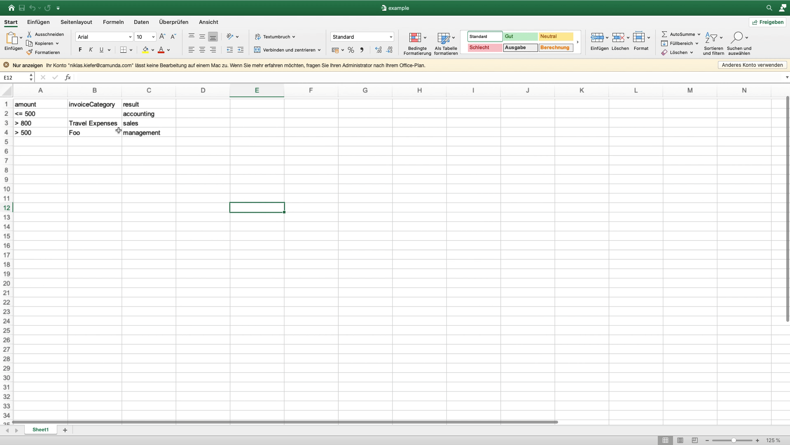

# camunda-modeler-excel-import-plugin

> :warning: This project depends on unreleased Camunda Modeler changes.

[](https://travis-ci.org/pinussilvestrus/camunda-modeler-excel-import-plugin) [](https://github.com/camunda/camunda-modeler)

[Camunda Modeler](https://github.com/camunda/camunda-modeler/) plugin to import Excel Sheets to DMN Tables.



## How to use

1. Download and copy this `plugin` subfolder into the `plugins` directory of the Camunda Modeler
2. Start the Camunda Modeler

Refer to the [plugins documentation](https://github.com/camunda/camunda-modeler/tree/master/docs/plugins#plugging-into-the-camunda-modeler) to get detailed information on how to create and integrate Camunda Modeler plugins.

## Development Setup

Firstly, clone this repository to your machine
```bash
$ git clone https://github.com/pinussilvestrus/excel-to-dmn-plugin.git
$ cd excel-to-dmn-plugin 
$ cd plugin
```

Install all dependencies

```bash
$ npm install
```

To work properly inside the Camunda Modeler this plugin needs to be bundled.

```bash
$ npm run all
```

## Compatibility Notice

This plug-in is currently only compatible with Camunda Modeler `v4.3+`.

## Contributors

This project was built at the 2020 Camunda Summer Hack days.

<a href="https://github.com/felixAnhalt"></a> <a href="https://github.com/pinussilvestrus"></a>

## Resources

* [Camunda Modeler plugins documentation](https://github.com/camunda/camunda-modeler/tree/master/docs/plugins#plugging-into-the-camunda-modeler)


## License

MIT
