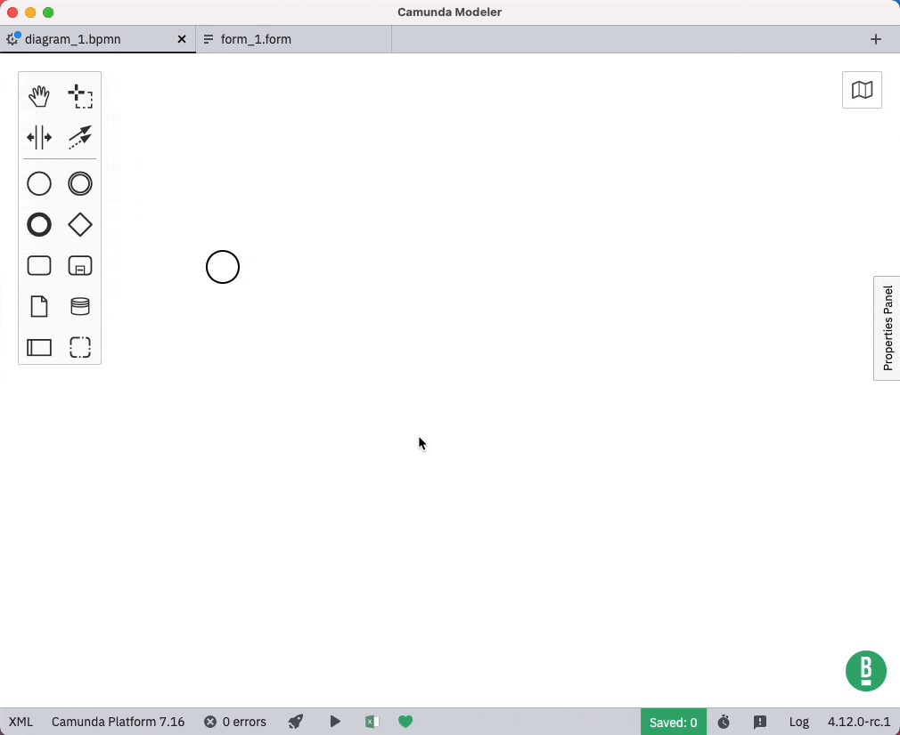

# camunda-modeler-excel-import-plugin

 [](https://github.com/camunda/camunda-modeler) [](#)

[Camunda Modeler](https://github.com/camunda/camunda-modeler/) plugin to import Excel Sheets to DMN 1.3 Decision Tables (and vice versa).



It's also possible to export existing DMN 1.3 Decision Tables to Excel Sheets.


## How to use

1. Download and copy this folder into the `plugins` directory of the Camunda Modeler
2. Start the Camunda Modeler

Refer to the [plugins documentation](https://docs.camunda.io/docs/components/modeler/desktop-modeler/plugins/) to get detailed information on how to create and integrate Camunda Modeler plugins.

## Development Setup

Firstly, clone this repository to your machine
```bash
$ git clone https://github.com/pinussilvestrus/camunda-modeler-excel-import-plugin.git
$ cd camunda-modeler-excel-import-plugin
```

Install all dependencies

```bash
$ npm install
```

To work properly inside the Camunda Modeler this plugin needs to be bundled.

```bash
$ npm run all
```

## Compatibility Notice

This plugin is currently only compatible with following Camunda Modeler versions.

| Camunda Modeler | Excel Plugin |
|---|---|
| 4.3 - 4.12  | 1.0 - 1.2 |
| 5.x | 1.3 or newer |

## Contributors

This project was built at the 2020 Camunda Summer Hack Days.

<a href="https://github.com/felixAnhalt"></a> <a href="https://github.com/pinussilvestrus"></a>

## Resources

* [Camunda Modeler plugins documentation](https://docs.camunda.io/docs/components/modeler/desktop-modeler/plugins/)


## License

MIT
